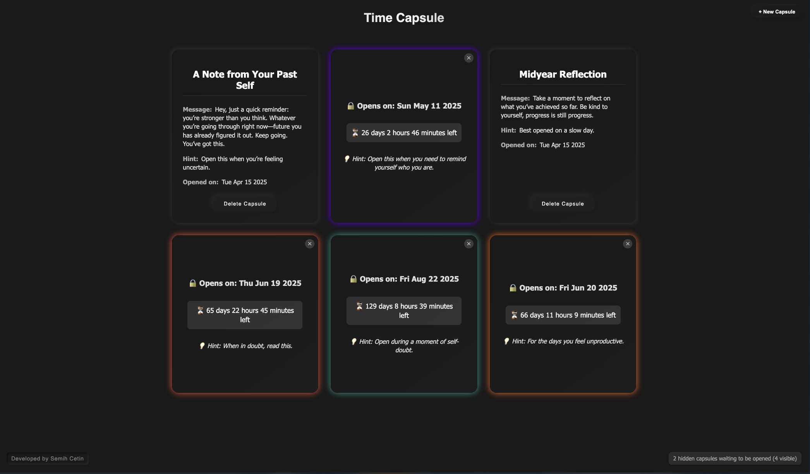
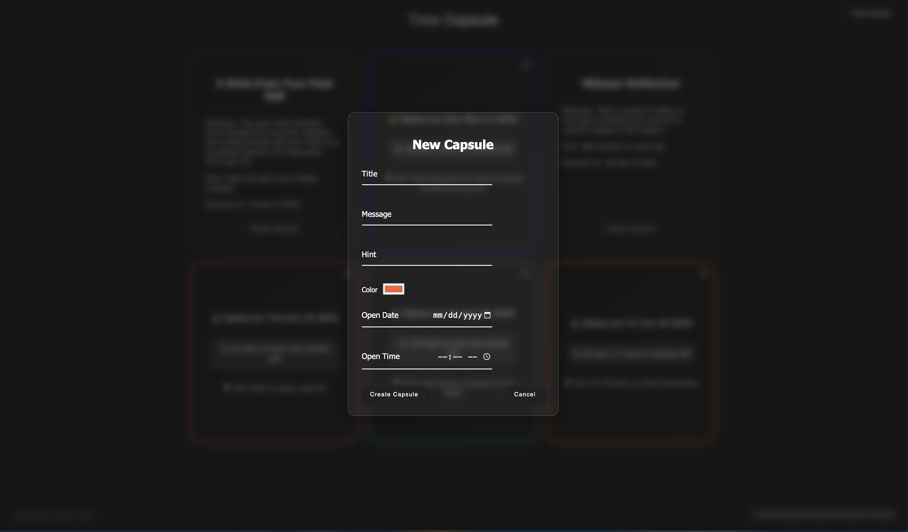
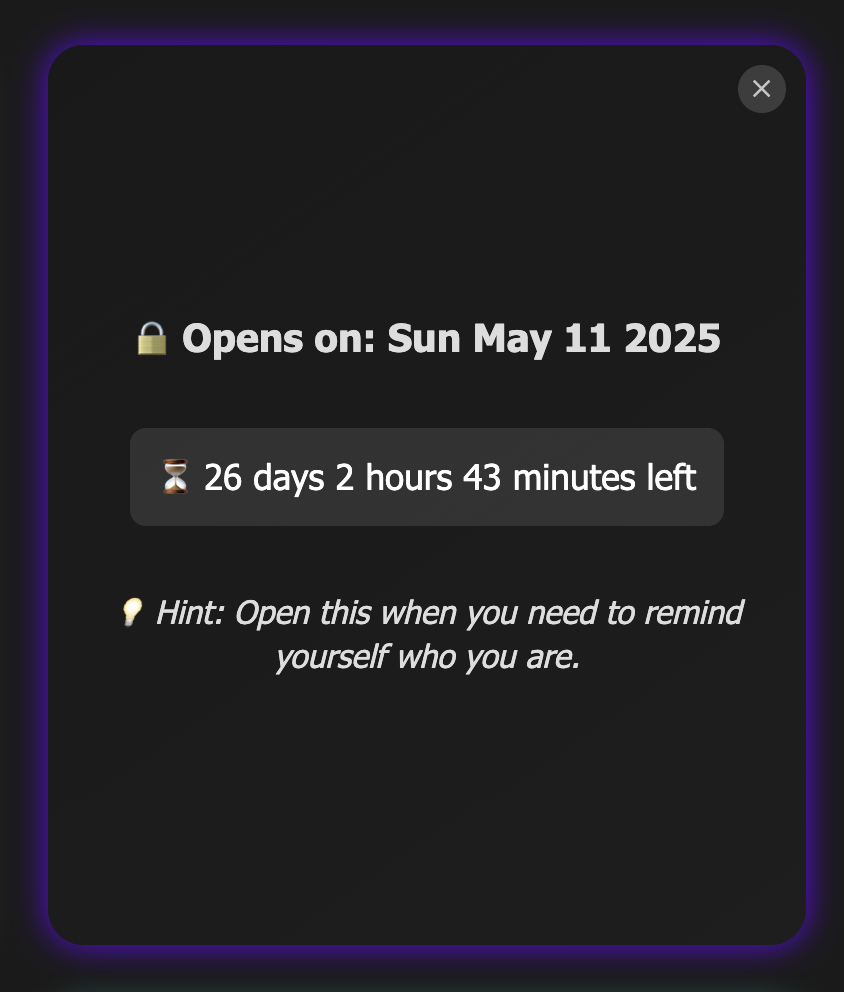

# TimeCapsule


A modern web application that lets you create digital time capsules with messages, hints, and customized appearance that will only be revealed on a specific future date.

## ✨ Features

- 🚀 Create digital time capsules with custom messages and hints
- 🔮 Set future dates when your capsules will be unlocked
- 🎨 Customize the appearance of your capsules with colors
- 🔐 Hide capsules until their opening date
- 📊 Track hidden capsules with a counter
- 🌐 Full-stack application with React frontend and Express/MongoDB backend

## 📱 Demo

Here are some screenshots of the TimeCapsule application:

<div align="center">
  
  <p><em>Home screen showing various time capsules</em></p>
  
  
  <p><em>Creating a new time capsule</em></p>
  
  
  <p><em>A locked capsule waiting to be opened</em></p>
</div>


## 🛠️ Technologies Used

### Frontend

- React (v19)
- Styled Components
- Vite

### Backend

- Node.js
- Express
- MongoDB Atlas
- Mongoose

## 🚀 Getting Started

### Prerequisites

- Node.js (v14 or higher)
- npm or yarn
- MongoDB Atlas account (or local MongoDB instance)

### Installation

1. Clone the repository:

```bash
git clone https://github.com/oksimveiti/TimeCapsule.git
cd TimeCapsule
```

2. Install dependencies for both client and server:

```bash
# Install client dependencies
cd client
npm install

# Install server dependencies
cd ../server
npm install
```

3. Environment Setup:
   - Create a `.env` file in the server directory
   - Add your MongoDB connection string:

```
MONGO_URI=mongodb+srv://<username>:<password>@<cluster>.mongodb.net/?retryWrites=true&w=majority&appName=<appname>
PORT=5500
```

4. Start the development servers:

```bash
# Start the backend server
cd server
npm start

# In a new terminal, start the frontend
cd client
npm run dev
```

5. Open your browser and navigate to `http://localhost:5173`

## 🧠 How It Works

1. **Creating a Capsule**: Enter a title, message, hint, and select a color for your capsule
2. **Setting a Date**: Choose when your capsule should be unlocked
3. **Viewing Locked Capsules**: Locked capsules show only the hint and countdown timer
4. **Hiding Capsules**: You can hide future capsules until their opening date
5. **Tracking Hidden Capsules**: A counter shows how many capsules are hidden
6. **Opening Capsules**: Once the date arrives, capsules automatically unlock and reveal their content

## 📊 Project Structure

```
TimeCapsule/
├── client/            # React frontend
│   ├── src/
│   │   ├── components/  # Reusable UI components
│   │   ├── css/         # CSS styles
│   │   ├── pages/       # Page components
│   │   └── App.jsx      # Main application component
│   └── ...
└── server/            # Node.js backend
    ├── models/        # MongoDB schemas
    ├── routes/        # API routes
    └── index.js       # Server entry point
```

## 🔮 Future Improvements

- User authentication
- Social sharing features
- Email notifications when a capsule is ready to open
- Media attachments (images, videos)
- Mobile application version

## 🤝 Contributing

Contributions, issues, and feature requests are welcome!

## 📝 License

This project is [MIT](LICENSE) licensed.

## 👨‍💻 Developer

Developed by [Semih Cetin](https://github.com/oksimveiti)

---

Thanks for checking out TimeCapsule! If you have any questions or suggestions, feel free to [open an issue](https://github.com/oksimveiti/TimeCapsule/issues/new) or contact me directly.
